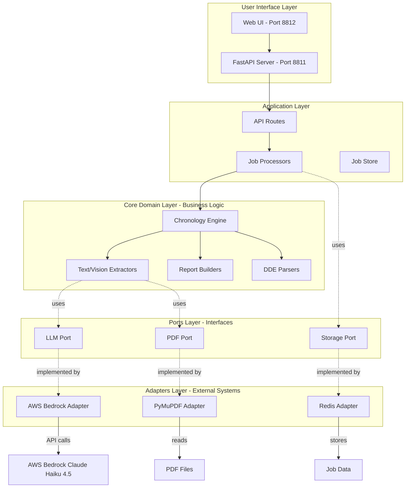
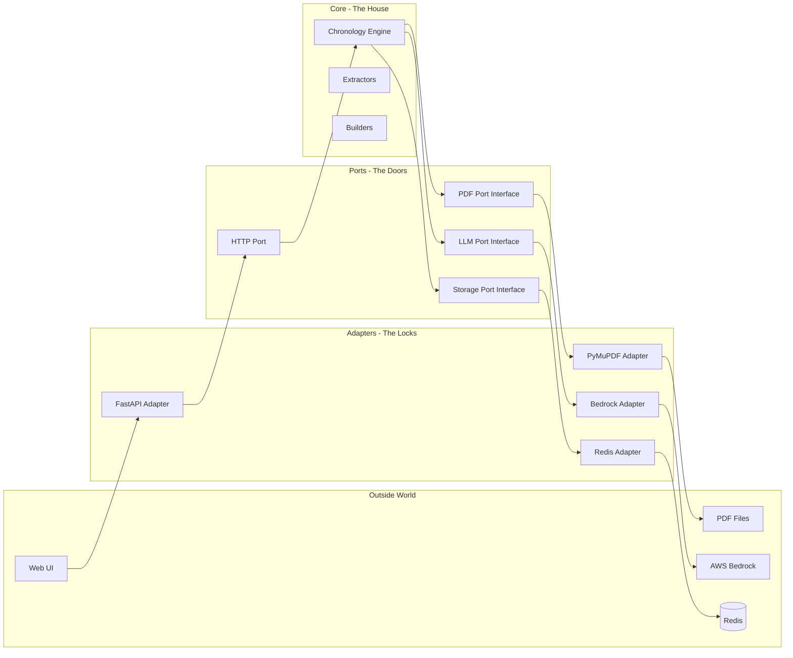
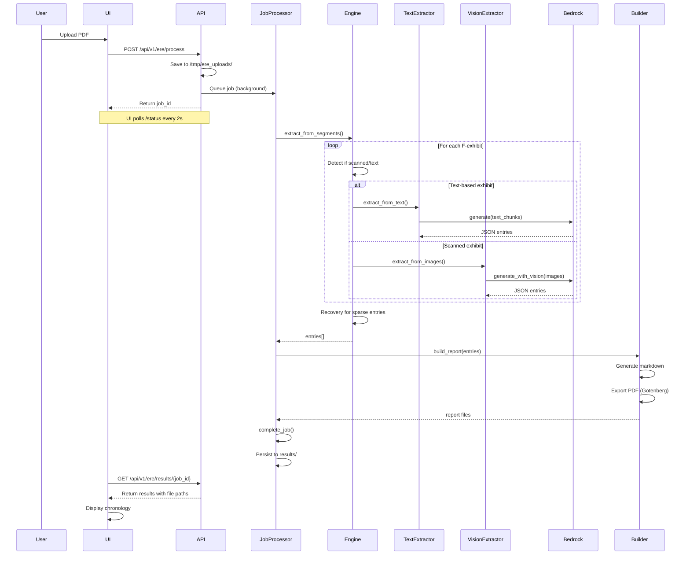
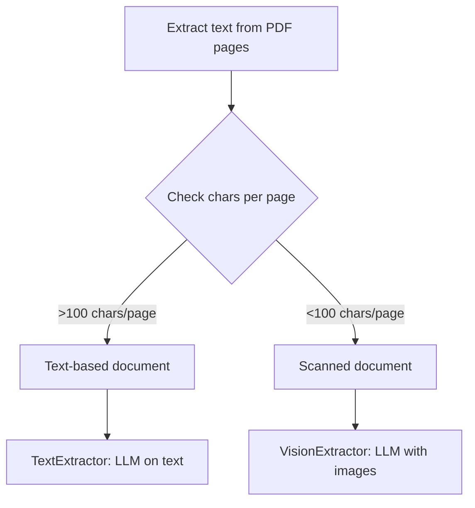
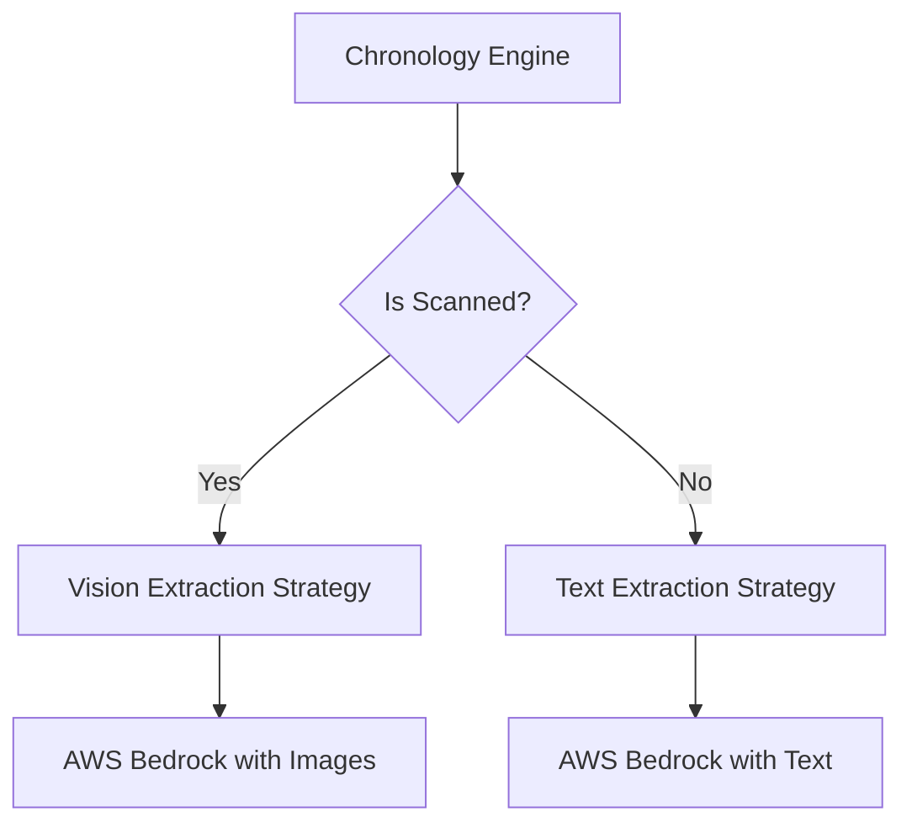

# ChartVision Chronology Engine - Complete Codebase Explanation

## 📋 Table of Contents
1. [What This System Does](#what-this-system-does)
2. [High-Level Architecture](#high-level-architecture)
3. [Hexagonal Architecture Pattern](#hexagonal-architecture-pattern)
4. [Processing Pipeline Flow](#processing-pipeline-flow)
5. [Core Components Deep Dive](#core-components-deep-dive)
6. [API Layer Explained](#api-layer-explained)
7. [Data Flow Examples](#data-flow-examples)
8. [Key Design Patterns](#key-design-patterns)

---

## 🎯 What This System Does

**ChartVision Chronology Engine** is a medical document processing system that:

1. **Accepts** SSA (Social Security Administration) disability case files (PDFs)
2. **Extracts** medical chronology entries from exhibits (Section F)
3. **Extracts** DDE (Disability Determination Explanation) data from Section A
4. **Generates** structured chronology reports (JSON, Markdown, PDF)

### Real-World Use Case

```
Input:  600-page SSA disability case PDF with 12 medical exhibits
Output: Chronological timeline of 118 medical events with:
        - Dates, providers, diagnoses, treatments
        - Accurate citations (exhibit + page numbers)
        - Structured JSON for downstream analysis
        - Human-readable Markdown report
```

---

## 🏗️ High-Level Architecture



### Architecture Layers Explained

| Layer | Purpose | Example Files | Dependencies |
|-------|---------|---------------|--------------|
| **UI** | User interaction | `app/ui/index.html` | None (static) |
| **API** | HTTP endpoints | `app/api/routes/*.py` | Application layer |
| **Application** | Job orchestration | `app/api/processors/*.py` | Core domain |
| **Core Domain** | Business logic | `app/core/extraction/*.py` | Ports only |
| **Ports** | Abstract interfaces | `app/core/ports/*.py` | None |
| **Adapters** | External integrations | `app/adapters/*/*.py` | External systems |

---

## 🔷 Hexagonal Architecture Pattern

### What is Hexagonal Architecture?

**Simple Analogy**: Think of it like a house with multiple doors (ports). Each door can have different types of locks (adapters), but the inside of the house (core logic) doesn't care which door you use.

### Visual Representation



### Why Use This Pattern?

✅ **Testability**: Mock ports easily without touching core logic
✅ **Flexibility**: Swap Bedrock for OpenAI without changing core
✅ **Isolation**: Core business logic has zero external dependencies
✅ **Clarity**: Clear boundaries between "what" and "how"

### Example: Swapping LLM Providers

```python
# Core code depends ONLY on the interface
class ChronologyEngine:
    def __init__(self, llm: LLMPort):  # Interface, not implementation
        self.llm = llm

    async def extract(self, text):
        return await self.llm.generate(text, model="haiku")

# Production: Use Bedrock
engine = ChronologyEngine(llm=BedrockAdapter())

# Testing: Use Mock
engine = ChronologyEngine(llm=MockLLM())

# Future: Switch to OpenAI without changing ChronologyEngine!
engine = ChronologyEngine(llm=OpenAIAdapter())
```

---

## 🔄 Processing Pipeline Flow

### Complete Request Flow



### Step-by-Step Breakdown

#### Step 1: Upload & Job Creation (0-2 seconds)

```python
# app/api/routes/ere.py:53-115

@router.post("/process")
async def process_ere_pdf(file: UploadFile):
    # 1. Generate unique job ID
    job_id = str(uuid.uuid4())

    # 2. Save PDF to temp location
    file_path = f"/tmp/ere_uploads/{job_id}_{file.filename}"
    with open(file_path, "wb") as f:
        f.write(await file.read())

    # 3. Create job entry
    active_jobs[job_id] = {
        "job_id": job_id,
        "status": "queued",
        "file_path": file_path,
        "progress": 0.0,
        "created_at": datetime.now()
    }

    # 4. Queue background processing
    background_tasks.add_task(process_ere_job, job_id, file_path)

    # 5. Return immediately
    return {"job_id": job_id, "status": "queued"}
```

**What happens**: API receives upload, saves file, creates tracking entry, returns control to user instantly.

#### Step 2: Bookmark Extraction (2-5 seconds)

```python
# app/api/processors/chronology_extractor.py:45-68

async def extract_from_pdf(self, pdf_path, job_id):
    # 1. Extract PDF bookmarks (table of contents)
    bookmarks = self.pdf_adapter.extract_bookmarks(pdf_path)

    # 2. Filter for F-section exhibits (medical records)
    f_exhibits = [
        b for b in bookmarks
        if re.match(r'^\d+F:', b['title'])
    ]
    # Result: ['1F: Progress Notes', '2F: Lab Results', ...]

    # 3. Create segments with page ranges
    segments = []
    for exhibit in f_exhibits:
        segments.append({
            'section': exhibit['section'],
            'title': exhibit['title'],
            'start_page': exhibit['page'],
            'end_page': exhibit['end_page'],
            'page_count': exhibit['page_count']
        })
```

**What happens**: PyMuPDF extracts bookmarks, filters for medical exhibits (1F, 2F, ...), creates page-range segments.

#### Step 3: Parallel Extraction (20-500 seconds, depending on size)

```python
# app/core/extraction/parallel_extractor.py:35-95

class ParallelExtractor:
    def __init__(self, max_concurrent=5):
        self.max_concurrent = max_concurrent
        self.semaphore = asyncio.Semaphore(max_concurrent)

    async def extract_all(self, segments, pdf_path):
        # Create extraction tasks for all segments
        tasks = [
            self._extract_with_limit(seg, pdf_path)
            for seg in segments
        ]

        # Run with concurrency limit
        results = await asyncio.gather(*tasks)
        return results

    async def _extract_with_limit(self, segment, pdf_path):
        async with self.semaphore:  # Only 5 concurrent
            return await self._extract_segment(segment, pdf_path)
```

**Visual of Parallel Processing:**

```
Time: 0s    10s   20s   30s   40s   50s   60s
      ↓     ↓     ↓     ↓     ↓     ↓     ↓
1F    [====extracting====]
2F    [====extracting====]
3F    [====extracting====]
4F    [====extracting====]
5F    [====extracting====]
6F          [====extracting====]  (waits for slot)
7F          [====extracting====]
8F                [====extracting====]
9F                [====extracting====]

^ 5 concurrent, rest wait for semaphore release
```

#### Step 4: Text vs Vision Routing

```python
# app/core/extraction/engine.py:150-180

async def _extract_segment(self, segment, pdf_path):
    # 1. Extract text from pages
    text = self.pdf_adapter.extract_text(
        pdf_path,
        segment['start_page'],
        segment['end_page']
    )

    # 2. Check if scanned (low text content)
    if self._is_scanned(text, segment['page_count']):
        # Use vision extraction
        return await self._vision_extractor.extract_from_images(
            pdf_path, segment
        )
    else:
        # Use text extraction
        return await self._text_extractor.extract_from_text(
            text, segment
        )

def _is_scanned(self, text, page_count):
    chars_per_page = len(text.strip()) / page_count
    return chars_per_page < 100  # Threshold for scanned pages
```

**Decision Tree:**



#### Step 5: LLM Extraction (Text Mode)

```python
# app/core/extraction/text_extractor.py:70-120

class TextExtractor:
    async def extract_from_text(self, text, segment):
        # 1. Load extraction prompt template
        prompt_template = self._load_prompt('text_extraction.yaml')

        # 2. Chunk text (40K chars max for Bedrock)
        chunks = self._chunk_text(text, max_chars=40000)

        # 3. Extract from each chunk
        all_entries = []
        for chunk in chunks:
            prompt = prompt_template.format(
                medical_text=chunk,
                exhibit_title=segment['title']
            )

            # Call LLM
            response = await self.llm.generate(
                prompt=prompt,
                model="haiku",
                max_tokens=4096
            )

            # Parse JSON response
            entries = self._parse_response(response)
            all_entries.extend(entries)

        return all_entries
```

**What the LLM sees:**

```
PROMPT:
Extract medical chronology entries from the following text.
Output JSON array with: date, provider, diagnosis, treatment, source.

TEXT:
10/15/2023 - Dr. Smith evaluated patient for chronic back pain...
[... 40,000 characters of medical records ...]

LLM RESPONSE:
[
  {
    "date": "10/15/2023",
    "provider": "Dr. Smith",
    "facility": "Pain Management Clinic",
    "chief_complaint": "Chronic back pain",
    "diagnosis": "L4-L5 disc herniation",
    "treatment": "ESI injection recommended",
    "source_citation": "1F@5"
  },
  ...
]
```

#### Step 6: Vision Extraction (Scanned Pages)

```python
# app/core/extraction/vision_extractor.py:55-110

class VisionExtractor:
    async def extract_from_images(self, pdf_path, segment):
        # 1. Render PDF pages as PNG images
        images = self.pdf_adapter.render_pages_as_images(
            pdf_path,
            start_page=segment['start_page'],
            end_page=segment['end_page'],
            dpi=150  # Balance quality vs. size
        )

        # 2. Load vision prompt
        prompt = self._load_vision_prompt()

        # 3. Call LLM with vision
        response = await self.llm.generate_with_vision(
            prompt=prompt,
            images=images,  # List of PNG bytes
            model="haiku",
            max_tokens=4096
        )

        # 4. Parse response
        entries = self._parse_response(response)
        return entries
```

**Visual Flow:**

```
PDF Pages → PyMuPDF → PNG Images → AWS Bedrock Claude Haiku 4.5
                                    ↓
                              OCR + Analysis
                                    ↓
                              JSON Entries
```

---

## 🌐 API Layer Explained

### Job State Machine

```mermaid
stateDiagram-v2
    [*] --> queued: Upload PDF
    queued --> processing: Background task starts
    processing --> processing: Update progress
    processing --> completed: Success
    processing --> failed: Error
    completed --> [*]
    failed --> [*]

    note right of processing
        Progress: 0.0 → 1.0
        Steps: bookmark_segmentation,
               dde_extraction,
               chronology_extraction,
               report_build,
               report_export
    end note
```



### Job Storage Strategy

```python
# app/api/storage/job_store.py:20-110

class JobStore:
    """In-memory job storage with disk persistence."""

    def __init__(self, storage_dir="results"):
        self._jobs: Dict[str, Any] = {}
        self.storage_dir = Path(storage_dir)

    def __setitem__(self, job_id: str, job_data: Dict):
        """Store job and auto-persist if completed/failed."""
        self._jobs[job_id] = job_data

        # Auto-persist finished jobs
        if job_data.get("status") in ["completed", "failed"]:
            self._persist_job(job_id)

    def _persist_job(self, job_id: str):
        """Save job to disk as JSON."""
        job_file = self.storage_dir / f"job_{job_id}.json"
        with open(job_file, 'w') as f:
            json.dump(self._jobs[job_id], f, indent=2, default=str)
```

**Storage Locations:**

| State | Storage | Location | Lifetime |
|-------|---------|----------|----------|
| `queued` | In-memory | `active_jobs` dict | Until completion |
| `processing` | In-memory | `active_jobs` dict | Until completion |
| `completed` | In-memory + Disk | `results/job_{id}.json` | Persistent |
| `failed` | In-memory + Disk | `results/job_{id}.json` | Persistent |

### Progress Tracking

```python
# app/api/processors/job_lifecycle.py:15-52

def update_progress(job, step_name, progress_value):
    """Update job progress for UI polling."""
    job["current_step"] = step_name
    job["progress"] = progress_value

    if step_name not in job.get("steps_completed", []):
        job.setdefault("steps_completed", []).append(step_name)

    # Estimate remaining time
    elapsed = (datetime.now() - job["started_at"]).total_seconds()
    estimated_total = elapsed / progress_value if progress_value > 0 else 0
    job["estimated_remaining"] = max(0, estimated_total - elapsed)

# Usage in extraction:
update_progress(job, "bookmark_segmentation", 0.1)
update_progress(job, "chronology_extraction", 0.5)
update_progress(job, "report_build", 0.9)
```

**UI Polling Response:**

```json
{
  "job_id": "abc-123",
  "status": "processing",
  "progress": 0.5,
  "current_step": "chronology_extraction",
  "steps_completed": ["bookmark_segmentation", "dde_extraction"],
  "estimated_remaining": 45
}
```

---

## 🔑 Key Design Patterns

### 1. Dependency Injection Pattern

**What it is**: Pass dependencies to components instead of creating them internally.

**Why**: Enables testing, flexibility, loose coupling.

```python
# ❌ BAD: Hard-coded dependency
class ChronologyEngine:
    def __init__(self):
        self.llm = BedrockAdapter()  # Tightly coupled!

# ✅ GOOD: Dependency injection
class ChronologyEngine:
    def __init__(self, llm: LLMPort):  # Interface injection
        self.llm = llm

# Production
engine = ChronologyEngine(llm=BedrockAdapter())

# Testing
engine = ChronologyEngine(llm=MockLLM())
```

### 2. Port and Adapter Pattern (Hexagonal Architecture)

**What it is**: Define interfaces (ports) that adapters implement.

**Files:**
- **Port**: `app/core/ports/llm.py` (interface)
- **Adapter**: `app/adapters/llm/bedrock.py` (implementation)

```python
# Port (Interface)
class LLMPort(ABC):
    @abstractmethod
    async def generate(self, prompt: str, model: str) -> str:
        pass

# Adapter (Implementation)
class BedrockAdapter(LLMPort):
    async def generate(self, prompt: str, model: str) -> str:
        # AWS Bedrock-specific code
        response = await self.bedrock_client.invoke_model(...)
        return response['content']
```

**Benefits:**
- Swap AWS Bedrock for OpenAI without changing core code
- Test with mock adapters
- Add new LLM providers easily

### 3. Strategy Pattern (Format-Based Extraction)

**What it is**: Select algorithm at runtime based on context.

```python
# app/core/extraction/engine.py:150-180

class ChronologyEngine:
    async def _extract_segment(self, segment, pdf_path):
        # Strategy selection based on content type
        if self._is_scanned(text, page_count):
            strategy = self._vision_extractor  # Vision strategy
        else:
            strategy = self._text_extractor     # Text strategy

        return await strategy.extract(pdf_path, segment)
```

**Visual:**



### 4. Builder Pattern (Report Generation)

**What it is**: Construct complex objects step-by-step.

```python
# app/core/builders/chartvision_builder.py:40-120

class ChartVisionBuilder:
    def __init__(self):
        self._report = ChartVisionReport()

    def add_claimant_info(self, dde_data):
        self._report.claimant_name = dde_data.get('name')
        self._report.ssn = dde_data.get('ssn')
        return self

    def add_chronology_entries(self, entries):
        self._report.chronology = sorted(entries, key=lambda e: e['date'])
        return self

    def add_statistics(self, stats):
        self._report.total_events = stats['event_count']
        self._report.provider_count = stats['unique_providers']
        return self

    def build(self) -> ChartVisionReport:
        return self._report

# Usage:
report = (ChartVisionBuilder()
    .add_claimant_info(dde_data)
    .add_chronology_entries(entries)
    .add_statistics(stats)
    .build())
```

### 5. Template Method Pattern (Extraction Base)

**What it is**: Define algorithm skeleton, let subclasses implement steps.

```python
# Simplified example
class BaseExtractor(ABC):
    async def extract(self, pdf_path, segment):
        # Template method - defines the algorithm
        data = await self._load_data(pdf_path, segment)
        prompt = self._prepare_prompt(data, segment)
        response = await self._call_llm(prompt)
        entries = self._parse_response(response)
        return self._post_process(entries, segment)

    @abstractmethod
    async def _load_data(self, pdf_path, segment):
        """Subclass implements"""
        pass

    @abstractmethod
    def _prepare_prompt(self, data, segment):
        """Subclass implements"""
        pass

class TextExtractor(BaseExtractor):
    async def _load_data(self, pdf_path, segment):
        return self.pdf_adapter.extract_text(...)

    def _prepare_prompt(self, data, segment):
        return self.text_prompt_template.format(medical_text=data)

class VisionExtractor(BaseExtractor):
    async def _load_data(self, pdf_path, segment):
        return self.pdf_adapter.render_pages_as_images(...)

    def _prepare_prompt(self, data, segment):
        return self.vision_prompt_template
```

---

## 💡 Interactive Examples

### Example 1: Testing with Mock Adapters

```python
# tests/test_engine.py

class MockLLM(LLMPort):
    """Mock LLM for testing - no AWS calls"""

    async def generate(self, prompt, model, **kwargs):
        # Return predictable test data
        return json.dumps([{
            "date": "01/15/2024",
            "provider": "Dr. Test",
            "diagnosis": "Test diagnosis",
            "source_citation": "1F@10"
        }])

    async def generate_with_vision(self, prompt, images, model, **kwargs):
        return json.dumps([{
            "date": "01/16/2024",
            "provider": "Dr. Vision",
            "diagnosis": "Scanned diagnosis",
            "source_citation": "2F@20"
        }])

# Test extraction without AWS
async def test_chronology_extraction():
    mock_llm = MockLLM()
    mock_pdf = MockPDFAdapter()

    engine = ChronologyEngine(llm=mock_llm)

    result = await engine.extract_from_segments(
        segments=[{"section": "1F", "title": "Test", "start_page": 1, "end_page": 5}],
        pdf_path="test.pdf"
    )

    assert len(result.events) == 1
    assert result.events[0]["provider"] == "Dr. Test"
```

### Example 2: Adding a New LLM Provider

```python
# app/adapters/llm/openai_adapter.py

from app.core.ports.llm import LLMPort, ModelConfig
import openai

class OpenAIAdapter(LLMPort):
    """OpenAI implementation of LLM port"""

    def __init__(self, api_key):
        self.client = openai.AsyncOpenAI(api_key=api_key)

    async def generate(self, prompt, model, **kwargs):
        response = await self.client.chat.completions.create(
            model="gpt-4",
            messages=[
                {"role": "system", "content": kwargs.get("system", "")},
                {"role": "user", "content": prompt}
            ],
            max_tokens=kwargs.get("max_tokens", 4096)
        )
        return response.choices[0].message.content

    async def generate_with_vision(self, prompt, images, model, **kwargs):
        # OpenAI vision implementation
        messages = [{
            "role": "user",
            "content": [
                {"type": "text", "text": prompt},
                *[{"type": "image_url", "image_url": {"url": f"data:image/png;base64,{img}"}}
                  for img in images]
            ]
        }]
        response = await self.client.chat.completions.create(
            model="gpt-4-vision-preview",
            messages=messages
        )
        return response.choices[0].message.content

# Usage - NO changes to core code!
engine = ChronologyEngine(llm=OpenAIAdapter(api_key="sk-..."))
```

### Example 3: Custom Storage Adapter

```python
# app/adapters/storage/s3_adapter.py

from app.core.ports.storage import JobStoragePort
import boto3

class S3StorageAdapter(JobStoragePort):
    """Store jobs in S3 instead of Redis/disk"""

    def __init__(self, bucket_name):
        self.s3 = boto3.client('s3')
        self.bucket = bucket_name

    async def store_job(self, job_id, job_data):
        self.s3.put_object(
            Bucket=self.bucket,
            Key=f"jobs/{job_id}.json",
            Body=json.dumps(job_data)
        )

    async def get_job(self, job_id):
        response = self.s3.get_object(
            Bucket=self.bucket,
            Key=f"jobs/{job_id}.json"
        )
        return json.loads(response['Body'].read())

# Swap storage without changing API code
api = EREPipelineAPI(job_storage=S3StorageAdapter("my-jobs-bucket"))
```

---

## 📊 Performance Characteristics

### Typical Processing Times

| Document Size | Exhibits | Pages | Processing Time | Primary Bottleneck |
|---------------|----------|-------|-----------------|-------------------|
| Small | 3-5 | 50-150 | 30-60s | LLM latency |
| Medium | 6-10 | 200-400 | 2-5 min | LLM latency |
| Large | 10-15 | 500-800 | 5-10 min | LLM + PDF parsing |
| Extra Large | 15+ | 1000+ | 10-20 min | LLM + vision |

### Optimization Strategies Used

1. **Parallel Extraction**: 5 concurrent exhibits (configurable)
2. **Text Chunking**: 40K char chunks prevent Bedrock timeouts
3. **Smart Vision Detection**: Only use vision for scanned pages (<100 chars/page)
4. **Recovery Retry**: Sparse entries get vision retry (instead of full re-extraction)
5. **Caching**: Job results persisted to disk for quick retrieval

---

## 📁 File Organization & Responsibilities

### Core Domain (`app/core/`)

```
app/core/
├── extraction/          # Extraction engine & components (4,639 lines)
│   ├── engine.py        # Main orchestrator (300 lines)
│   ├── text_extractor.py    # Text-based extraction
│   ├── vision_extractor.py  # Vision-based extraction
│   ├── parallel_extractor.py # Concurrent processing
│   ├── recovery_handler.py  # Sparse entry recovery
│   └── citation_resolver.py # Exhibit citation mapping
│
├── builders/           # Report generation
│   ├── chartvision_builder.py  # Report assembly
│   ├── report_generator.py     # Markdown generation
│   └── occurrence_formatter.py # Event formatting
│
├── parsers/           # DDE parsing
│   ├── dde_parser.py      # Section A extraction
│   └── dde_normalizer.py  # DDE result normalization
│
├── models/            # Domain models
│   ├── entry.py       # Chronology entry
│   ├── citation.py    # Citation model
│   └── chartvision.py # Report model
│
└── ports/             # Interfaces (NO implementation)
    ├── llm.py         # LLM abstraction
    ├── pdf.py         # PDF operations
    └── storage.py     # Job storage
```

### Adapters Layer (`app/adapters/`)

```
app/adapters/
├── llm/
│   └── bedrock.py         # AWS Bedrock implementation
│
├── pdf/
│   └── pymupdf.py         # PyMuPDF implementation
│
├── storage/
│   └── redis_adapter.py   # Redis implementation
│
└── export/
    ├── markdown_exporter.py
    └── pdf_exporter.py
```

### API Layer (`app/api/`)

```
app/api/
├── routes/            # HTTP endpoints
│   ├── ere.py         # /api/v1/ere/* endpoints
│   ├── chartvision.py # /api/v1/chartvision/* endpoints
│   └── health.py      # Health checks
│
├── processors/        # Background job handlers
│   ├── dde_extractor.py        # DDE extraction logic
│   ├── chronology_extractor.py # Chronology extraction
│   ├── report_builder.py       # Report building
│   └── job_lifecycle.py        # Job state management
│
├── storage/
│   └── job_store.py   # In-memory + disk persistence
│
└── middleware/
    └── authentication.py  # API key verification
```

---

## ⚠️ Common Pitfalls & Best Practices

### Pitfall 1: Tight Coupling to External Services

**❌ Bad:**
```python
class Extractor:
    def __init__(self):
        self.bedrock = BedrockAdapter()  # Hard-coded!
```

**✅ Good:**
```python
class Extractor:
    def __init__(self, llm: LLMPort):  # Dependency injection
        self.llm = llm
```

**Why**: Makes testing impossible, locks you into Bedrock forever.

---

### Pitfall 2: Mixing Business Logic with Infrastructure

**❌ Bad:**
```python
# In core/extraction/engine.py
def extract(self):
    result = boto3.client('bedrock').invoke_model(...)  # AWS in core!
```

**✅ Good:**
```python
# In core/extraction/engine.py
def extract(self):
    result = await self.llm.generate(prompt)  # Port abstraction
```

**Why**: Core should be pure business logic, no infrastructure.

---

### Pitfall 3: Global State

**❌ Bad:**
```python
# Global variable
active_jobs = {}

def process_job(job_id):
    global active_jobs  # Harder to test, race conditions
    active_jobs[job_id] = {...}
```

**✅ Good:**
```python
class JobStore:
    def __init__(self):
        self._jobs = {}

    def store(self, job_id, data):
        self._jobs[job_id] = data

# Dependency injection
job_store = JobStore()
processor = JobProcessor(job_store=job_store)
```

**Why**: Testable, no race conditions, clear ownership.

---

### Pitfall 4: Bare Except Clauses

**❌ Bad:**
```python
try:
    await llm.generate(prompt)
except:  # Catches EVERYTHING, including SystemExit!
    print("Something went wrong")
```

**✅ Good:**
```python
try:
    await llm.generate(prompt)
except (ClientError, TimeoutError) as e:
    logger.error(f"LLM error: {e}")
    raise ExtractionError(f"Failed to extract: {e}")
except Exception as e:
    logger.exception("Unexpected error")
    raise
```

**Why**: Allows keyboard interrupts, logs properly, specific handling.

---

### Pitfall 5: Not Using Async Properly

**❌ Bad:**
```python
async def extract_all(segments):
    results = []
    for seg in segments:
        result = await extract_segment(seg)  # Sequential!
        results.append(result)
    return results
```

**✅ Good:**
```python
async def extract_all(segments):
    tasks = [extract_segment(seg) for seg in segments]
    results = await asyncio.gather(*tasks)  # Parallel!
    return results
```

**Why**: Bad version takes 5x longer (5 segments × 60s = 5min vs. 60s).

---

## 🎓 Learning Resources & Next Steps

### Beginner Level (Understanding the Basics)

**Topics to Study:**
1. **Hexagonal Architecture** (Ports & Adapters)
   - Resource: [Netflix's Hexagonal Architecture](https://netflixtechblog.com/ready-for-changes-with-hexagonal-architecture-b315ec967749)
   - Time: 30 minutes

2. **Dependency Injection**
   - Resource: [Real Python - Dependency Injection](https://realpython.com/python-type-checking/)
   - Time: 45 minutes

3. **Async/Await in Python**
   - Resource: [AsyncIO Documentation](https://docs.python.org/3/library/asyncio.html)
   - Time: 1 hour

**Practice Project:**
Build a mini version with:
- Single exhibit extraction
- Mock LLM adapter (returns hardcoded JSON)
- Simple API endpoint

---

### Intermediate Level (Deep Dive)

**Topics to Study:**
1. **Design Patterns** (Strategy, Builder, Template Method)
   - Resource: "Head First Design Patterns" (Python version)
   - Time: 4-6 hours

2. **LLM Integration Best Practices**
   - Chunking strategies
   - Prompt engineering
   - Error handling

3. **Clean Architecture**
   - Resource: "Clean Architecture" by Robert C. Martin
   - Time: 2-3 days

**Practice Project:**
Add features to codebase:
- New export format (Word/Excel)
- Different LLM provider (OpenAI)
- Enhanced error recovery

---

### Advanced Level (System Design)

**Topics to Study:**
1. **Distributed Systems**
   - Horizontal scaling
   - Message queues (RabbitMQ/Kafka)
   - Caching strategies

2. **Performance Optimization**
   - Profiling async code
   - Database query optimization
   - LLM cost optimization

3. **Production Deployment**
   - Docker/Kubernetes
   - Monitoring & observability
   - Circuit breakers

**Practice Project:**
Design improvements:
- Scale to 1000s of concurrent jobs
- Add Redis caching layer
- Implement webhook notifications
- Add Prometheus metrics

---

## 🔍 Code Quality Metrics

### Current Stats

| Metric | Value | Status |
|--------|-------|--------|
| **Test Coverage** | 250+ tests passing | ✅ Excellent |
| **Lines of Code** | ~15,000 | ✅ Moderate |
| **Cyclomatic Complexity** | Avg 3.2 | ✅ Low (good) |
| **File Size** | Max 350 lines | ✅ Well modularized |
| **Dependencies** | Core → 0 external | ✅ Clean architecture |

### Architecture Compliance

```mermaid
graph LR
    subgraph "✅ GOOD: Clean Dependencies"
        Core[Core Domain] -.->|depends on| Ports[Ports]
        Adapters[Adapters] -.->|implements| Ports
        API[API Layer] --> Core
    end

    subgraph "❌ BAD: Would be violation"
        Core2[Core Domain] -.->|X depends on| Bedrock[Bedrock Adapter]
    end

    style Core fill:#90EE90
    style Ports fill:#90EE90
    style Adapters fill:#90EE90
    style API fill:#90EE90
    style Core2 fill:#FFB6C1
    style Bedrock fill:#FFB6C1
```



---

## 🚀 Quick Start for Contributors

### 1. Setup Development Environment

```bash
# Clone repository
git clone https://github.com/LexMed-AI/chartvision_chron_py.git
cd chartvision_chron_py

# Create virtual environment
python3 -m venv venv
source venv/bin/activate

# Install dependencies
pip install -r requirements.txt

# Set environment variables
export AWS_ACCESS_KEY_ID=your_key
export AWS_SECRET_ACCESS_KEY=your_secret
export AWS_DEFAULT_REGION=us-east-1
```

### 2. Run Tests

```bash
PYTHONPATH=. pytest tests/ -v
```

### 3. Start Servers

```bash
# Terminal 1: Backend API
PYTHONPATH=. python3 -m uvicorn app.api.ere_api:create_app --factory --port 8811

# Terminal 2: Frontend UI
cd app/ui && python3 -m http.server 8812
```

### 4. Make Your First Change

**Easy wins:**
1. Add a new export format (app/adapters/export/)
2. Improve error messages
3. Add more tests
4. Update documentation

**Medium challenges:**
1. Add OpenAI adapter
2. Implement caching layer
3. Add new extraction format
4. Optimize performance

---

## 📚 Summary & Key Takeaways

### What Makes This Codebase Special?

1. **Clean Architecture**: Core business logic has ZERO external dependencies
2. **Testability**: Mock any external service via ports
3. **Scalability**: Parallel processing with configurable concurrency
4. **Maintainability**: Small, focused modules (max 350 lines)
5. **Flexibility**: Swap LLM/PDF/Storage without core changes

### The Mental Model

```
Think of this system as a FACTORY:

INPUT:  PDF with medical records
STEPS:  1. Segment by bookmarks
        2. Detect text vs scanned
        3. Route to appropriate extractor
        4. Extract chronology entries (parallel)
        5. Build structured report
OUTPUT: JSON + Markdown + PDF chronology
```

### Core Principles Applied

✅ **Dependency Inversion**: High-level modules depend on abstractions
✅ **Single Responsibility**: Each class does ONE thing
✅ **Open/Closed**: Open for extension, closed for modification
✅ **Interface Segregation**: Clients depend only on what they use
✅ **Don't Repeat Yourself**: Shared logic extracted to utilities

---

## 🎯 Where to Go from Here?

1. **Explore a component**: Pick `app/core/extraction/engine.py` and read line-by-line
2. **Run the tests**: See how mocks work (`tests/unit/core/extraction/`)
3. **Trace a request**: Upload a PDF, follow the code execution
4. **Make a change**: Add a simple feature with tests
5. **Read the docs**: `docs/ere-reference-guide.md` for domain knowledge

**Questions?** The code is designed to be self-explanatory:
- Clear naming (`extract_from_text` not `process`)
- Type hints everywhere (`llm: LLMPort`)
- Docstrings on public interfaces
- Comments for complex logic only

Happy coding! 🚀
